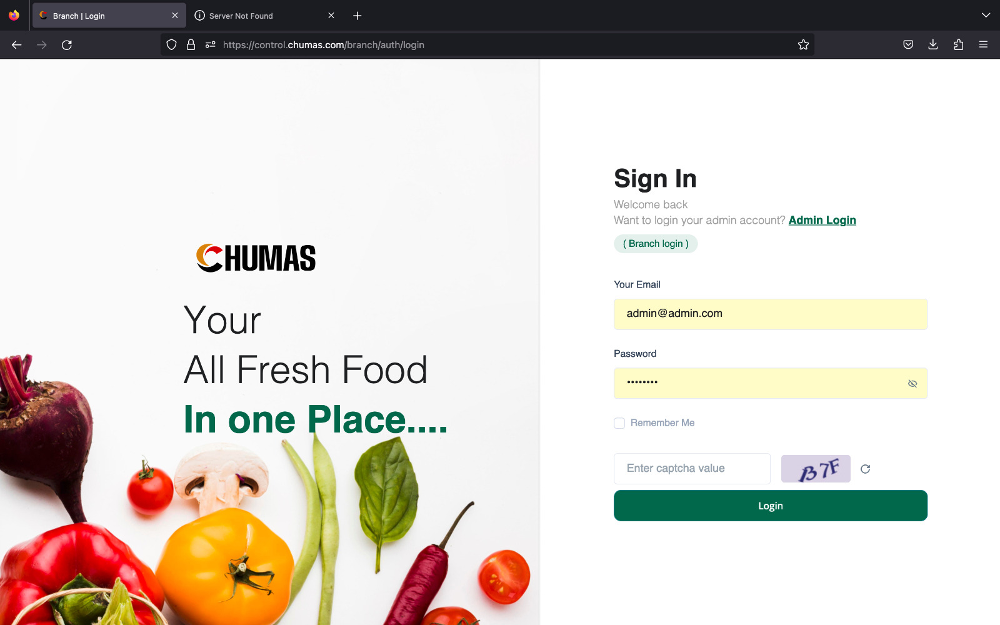

# Getting started with Chumas Product Management System

**Chuma's e-Commerce platform** employs a tiered user authentication system, granting access to different functionalities based on user roles.
The system recognizes two distinct user categories:

## 1. Admin or Employee Login

**Role:** Encompasses users with administrative or operational responsibilities across the entire platform.
**Permissions:** Broadest access level, including product management, pricing, promotions, customer support, order fulfillment, and system administration.
This hierarchical structure ensures appropriate access control and efficient management of the e-commerce platform.

## 2. Branch Login

**Role:** Typically associated with personnel managing physical branches of the e-commerce business.
**Permissions:** Includes customer management, inventory management, order processing, and potentially sales reporting within their specific branch.

