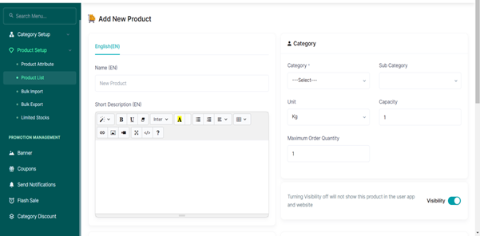
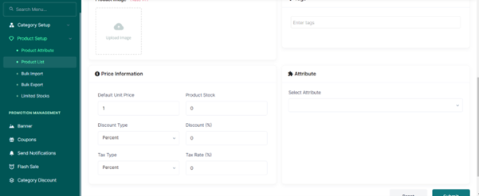

# Adding New Products

●	From the product setup tab, access the product list tab  
●	Tap the add new product button  
●	Input the name of the product and a short description of the product  

●	Select the category of the new product (if It's a carbohydrate, protein, etc)  
●	Select the sub-category of the new product (if it is seafood, legume, grains, etc)  
●	Input the unit of the new product  
●	Select the number available of the new product  
●	Select the maximum quantity that can be ordered  
●	Upload an image of the new product  
●	Input the price of the product in the unit price  
●	Input the number of available Stock   
●	Put a discount price if needed and a tax type  
●	Press the submit button   

