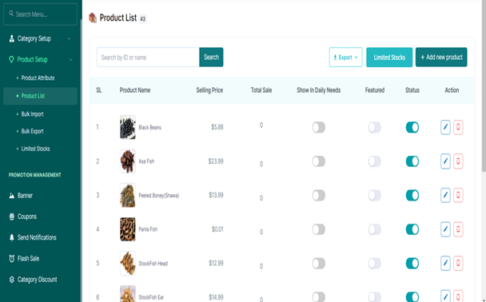

# Creating a New Attribute Table

●	From the product setup tab, access the attribute table tab  
●	Tap the add attribute   
●	Type the new attribute you would like to add  
●	Press the submit button.  

