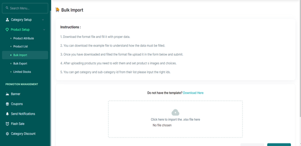

# Performing a Bulk Import

•	From the Product Setup, Access the Bulk Import Tab   
•	Follow the Instructions above.  
•	Download the Template.  
•	Note: Ensure you use a .xlsx file in the file import option.  

