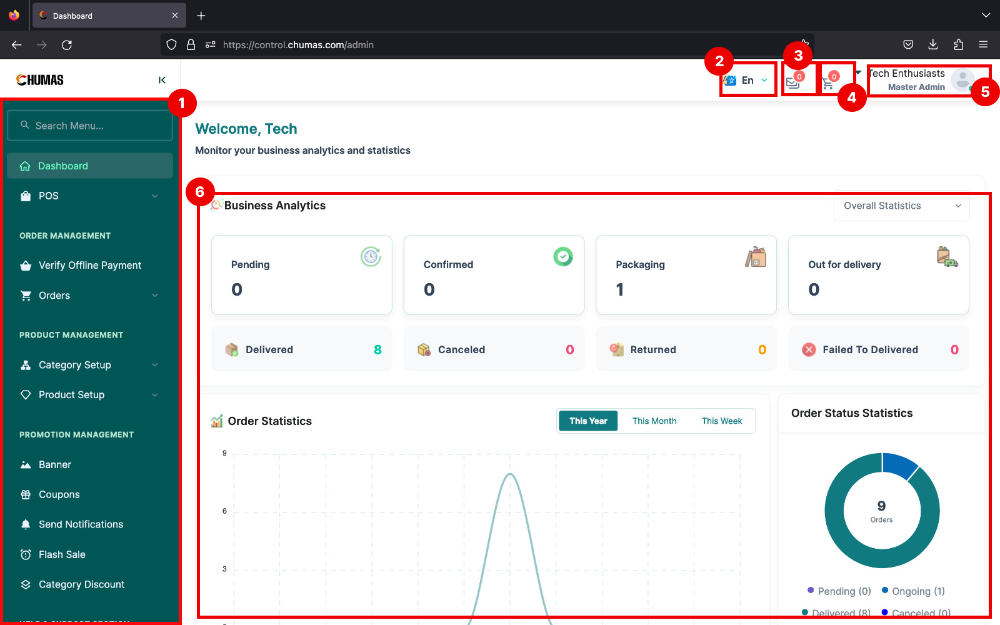
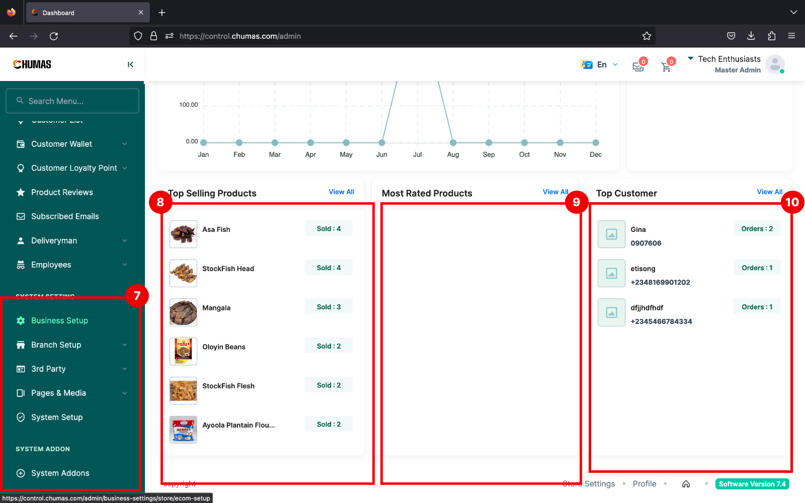

# Dashboard

The Dashboard is your central hub for managing your e-commerce operations
 within the Chumas system. It offers a streamlined interface for efficiently 
 overseeing various aspects of your business.

 

 ## 1. Navigation Sidebar

 The Navigation Sidebar serves as the primary access point to all system functionalities. 
 Strategically positioned on the left-hand side of the dashboard, it provides a clear and organized 
 menu structure, enabling users to efficiently navigate through the platform.

## 2. Language Selector

The Language Selector is a user-friendly feature designed to enhance accessibility
and user experience within the Chuma's e-Commerce Product Management System. 
Strategically placed within the top navigation bar it allows users to effortlessly 
switch between available languages.

## 3. Mail

The Mail module is a critical component of the Chuma's e-Commerce Product Management System,
dedicated to managing email communications and interactions. Given the sensitive nature of email
correspondence, including customer data, marketing campaigns, and transactional messages,
access to this module is strictly restricted to super administrators.

## 4. Cart

Click here to open the total summary of orders in the chumas system, this page contains information about pending orders,
fufilled orders etc. 

## 5. Account

Click here to open your Account settings page. This is helpful if you want to
look at or update your account information, upload a profile picture, reset your
password or log out of your account.

## 6. Statistics

The Statistics module within Chumas e-Commerce Product Management System provides
a comprehensive overview of business performance through data visualization and analysis.
This module offers valuable insights into various aspects of the e-commerce operations,
empowering decision-makers to make informed choices.

 

## 7. System settings

The System Settings section serves as the administrative control center for the Chuma's e-Commerce Product Management System. It encompasses several key tabs for comprehensive system management:

Branch Creation: Create and configure different business branches.
System Setup: Configure core system parameters, such as currency, tax, payments, and shipping.
Pages: Create and manage static pages for informational content.
Media: Store and manage media assets used throughout the system.
This centralized hub empowers administrators to tailor the platform to specific business needs and ensure optimal system performance.

## 8. Top Selling

The Top Selling Products section provides a dynamic overview of the most popular items
within the e-commerce platform. This feature offers valuable insights into customer 
preferences and sales trends.

## 9. Most Rated

The Most Rated Products section highlights items that have garnered the highest customer
satisfaction. This feature serves as a powerful tool for showcasing popular and trusted
products, influencing purchase decisions, and driving sales.

## 10. Top Customers

The Top Customers section provides a comprehensive overview of high-value
customers within the e-commerce platform. By identifying and understanding 
these customers, businesses can implement targeted strategies to foster loyalty
 and maximize revenue.

