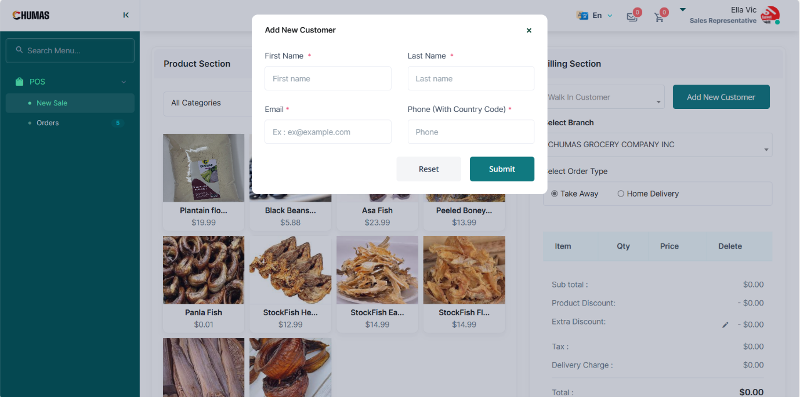

# Adding a New Customer

•	From the POS Tab, access the New Sale Tab  
•	In the Billing Section, tap the Add New Customer Button   
•	Input the Customer's First Name, Last Name, Email, and Phone Number.  
•	Tap the Submit Button or The Reset Button to clear the inputs.  

