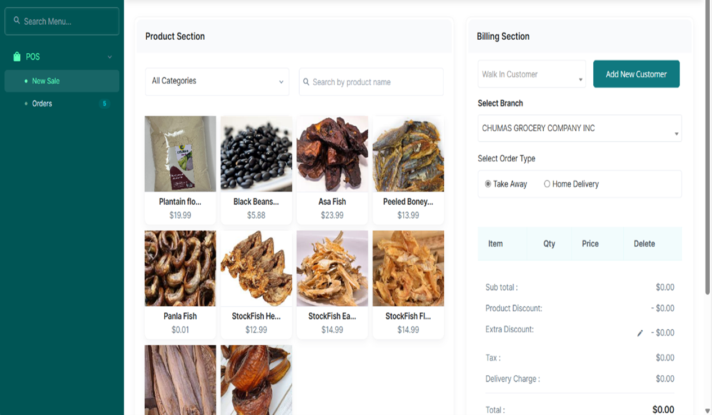
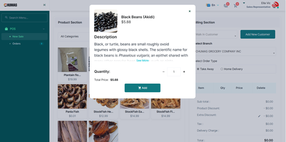
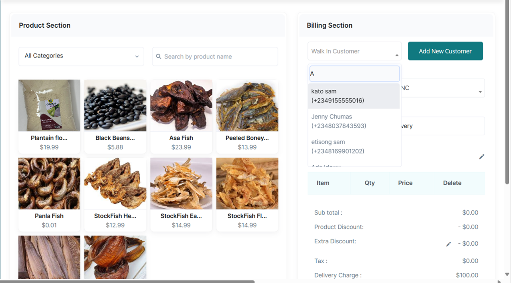
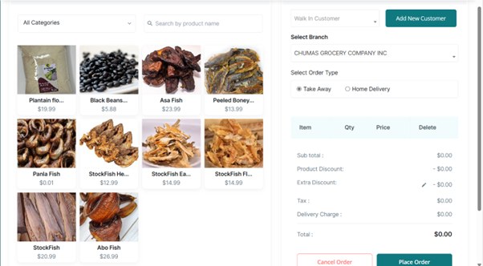
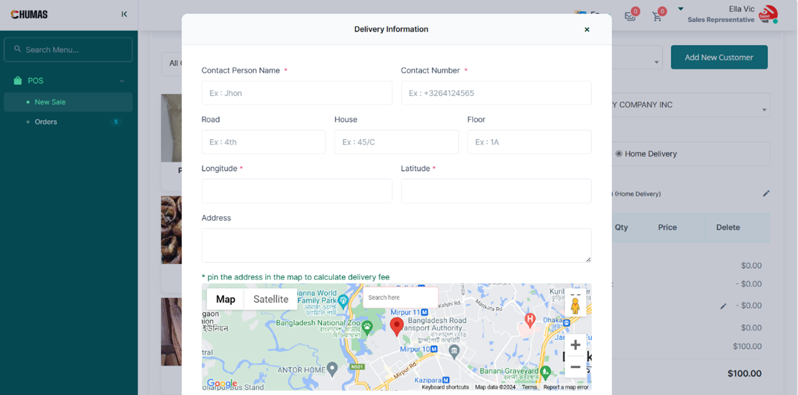
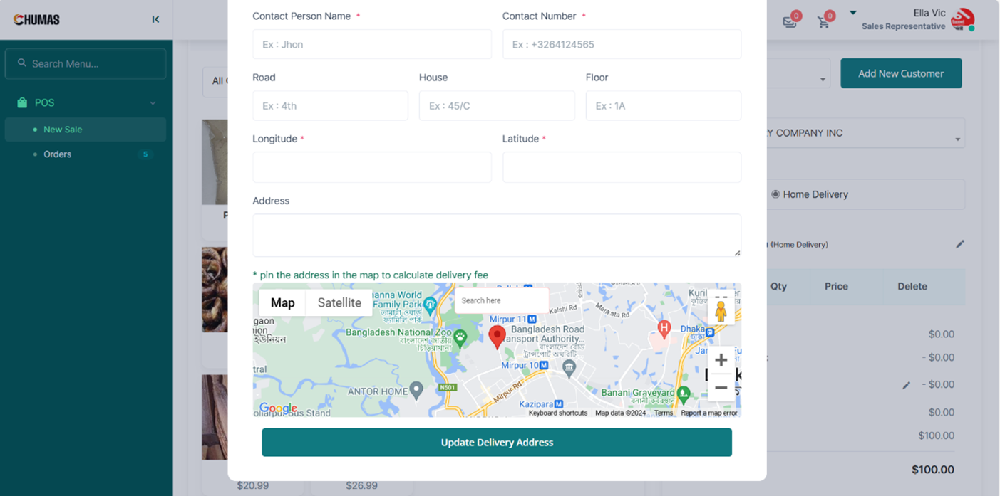

# Billing A Customer

•	From the POS Tab, access the New Sale Tab    
•	In the Product Section, Select the Product Ordered by the Customer or search for the Product using the  
 Search by Product Name bar.    

•	Tap on the correct product to access the pop-up card  

•	Select the Quantity ordered by tapping the plus icon on the right.  
•	Tap the Add Button.  
•	In the Billing Section, Select the Customer who Ordered.  

•	Select the Company’s Branch which the product was ordered from.  

•	Select the Order Type as Take Away    
•	Select the Payment Method as Cash or Card and tap the Place Order Button.    
•	Tap the Proceed if Thermal Printer is Ready Button to Print out the Customer’s Invoice    
•	If it is Home Delivery: Click the pencil Icon by Delivery Information to access the Delivery  
 Information pop-up card.    

•	Input Customer Name, Phone Number, Road Address, House Number, Floor Number.  
•	Input the full address  

•	On the Map, Input Address in the Search bar  
•	Once the Longitude and latitude spaces have been filled, tap the Update Delivery Address Button.  
