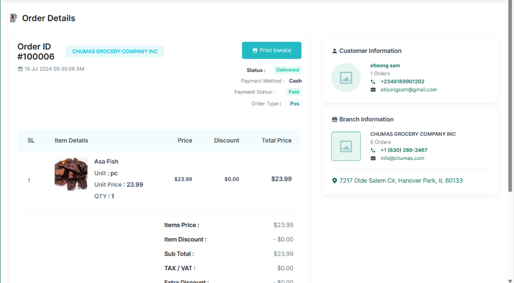

# Contacting a Customer

•	From the Orders Tab; search for and select the particular customer’s order.  
•	Tap the customer’s order ID to the order details page  

•	At the Customer Information section, click on the phone 
number to call/text the customer or tap on the email address to send them an email.