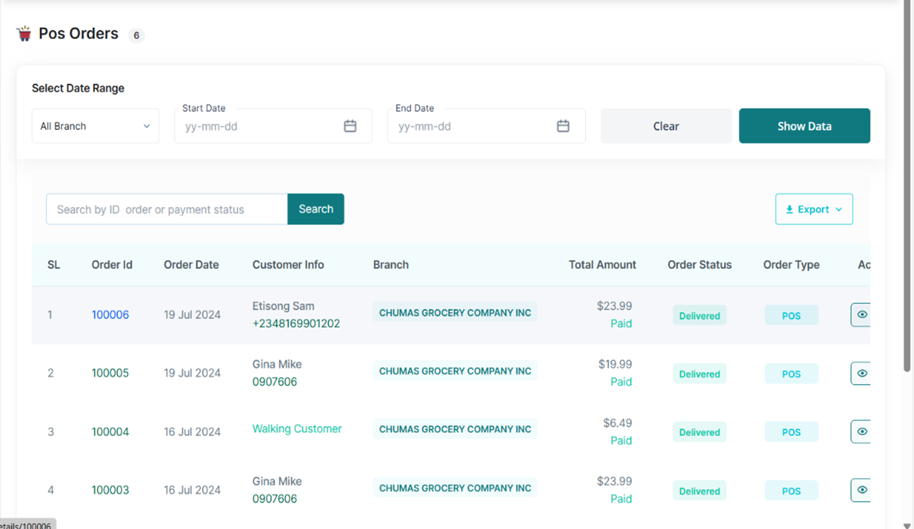
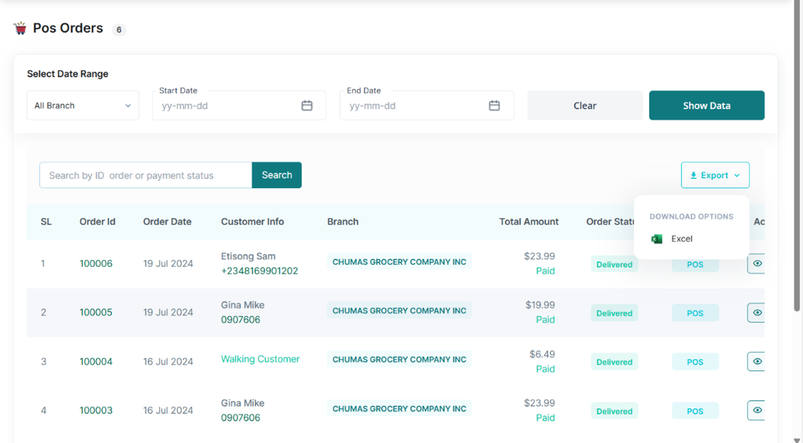

# View all Delivered Orders

•	From the POS Tab, access the Orders Tab  
•	To find a particular order, enter the Order Id or Payment Status of the order in the search bar.  

•	To find a Narrowed list of orders, Access the select date range Section and input the company’s
branch involved, the start date, end date, and tap the Show Data Button.     

•	To Download this list, tap the export link and select the Excel option.  

