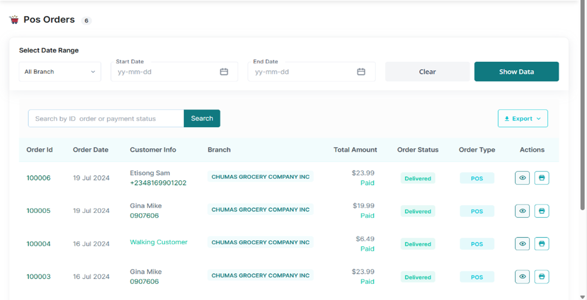
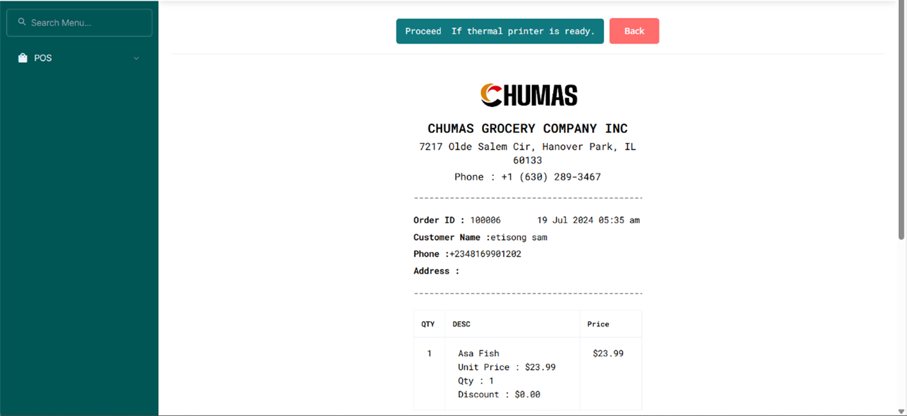

# Viewing Customer Order Details

•	From the Orders Tab; search for and select the particular customer’s order.  

•	Tap the customer’s order ID or the “eye” button in the actions section to access the order details  

•	To print out their Invoice, Tap the printer button in the actions section or tap the customer’s 
order ID and click the Print Invoice Button;
 Tap the Proceed if Thermal Printer is Ready Button to Print out the Invoice.