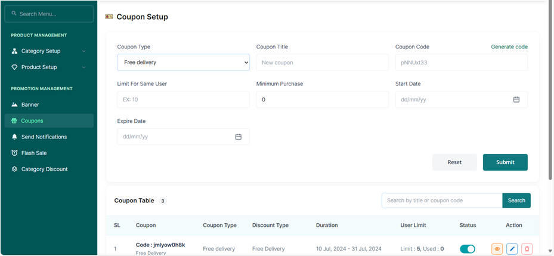

# Creating a Free Delivery Discount

•	From Promotion Management, Access the Coupons Tab.  
•	Select the Coupon Type as Free Delivery.  
•	Input A Coupon Title   
•	Generate a Coupon Code using the generate code button above the Generate Code   
•	To limit the number of times a customer can use the coupon, Input the number in the Limit for Same User Space Bar.  

•	Input the minimum number of products the customer must add to their cart to access the coupon.  
•	Select the Starting Date of the Coupon from the Start Date Space Bar.  
•	Select the Expiry Date of the Coupon from the Expiry Date Space Bar.  
•	Press the Submit Button.  
•	Or the Reset Button to Erase your Entry.  
