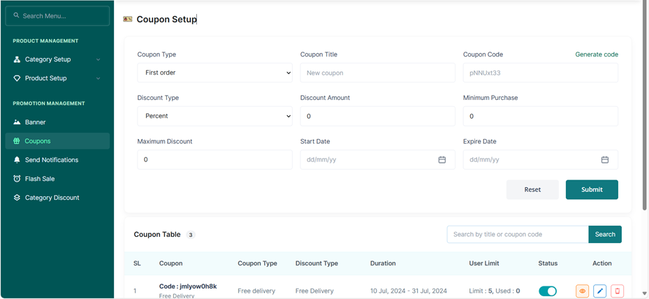

# Creating a First Order Discount
•	From Promotion Management, Access the Coupons Tab.   
•	Select the Coupon Type as First Order  
•	Input A Coupon Title   

•	Generate a Coupon Code using the generate code button above the Generate Code   
•	Choose if the Discount is in percentage or amount from the Discount Type.  
•	Input the Discount amount either as a percentage or a direct amount.  
•	Input the minimum number of products the customer must add to their cart to access the coupon.  
•	Input the Maximum Discount the customer can access through the Coupon.  
•	Select the Starting Date of the Coupon from the Start Date Space Bar.  
•	Select the Expiry Date of the Coupon from the Expiry Date Space Bar.  
•	Press the Submit Button.   
•	Or the Reset Button to Erase your Entry.  

